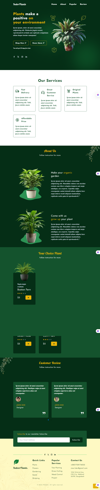

# IndorePlants 🌿
---
A fully responsive wave-style landing page design built using **Tailwind CSS** and **JavaScript**. This project was created primarily to showcase design skills for a portfolio. The animations are implemented with JavaScript, but no complex interactivity has been added since the focus was purely on layout and responsiveness.



## 🚀 Live Preview

[Click here to view the live site](https://indor-plants.vercel.app/)

## 📂 Project Features

- 🌊 Beautiful wave design layout
- 💻 Fully responsive across devices
- 🎨 Built with Tailwind CSS utility-first framework
- 🧩 JavaScript animations for smooth transitions
- 📱 Mobile-first design
- 🧪 Clean, minimal UI suitable for portfolios

## 🛠️ Tech Stack

- **HTML5**
- **Tailwind CSS**
- **JavaScript**

## 🧾 How to Run Locally

To run this project on your local device, follow these simple steps:

1. **Clone the repository**  
   ```bash
   git clone https://github.com/ziaul-hoque4820/IndorPlants.git
   ```
2. **Clone the repository**
cd indoreplants

3. **Open the index.html file in your browser**
You can simply double-click the index.html file or run a live server if you have one (e.g., using VS Code Live Server extension).

### 📌 Notes
- This project is purely front-end. No backend or framework dependencies.
- The goal was to showcase responsive design using modern CSS techniques (Tailwind).
- Interactivity can be added later if required.

## 👨‍💻 Author

**Ziaul Hoque Patwary**  
📧 Email: [**ziaul.dev@gmail.com**] 
🔗 GitHub: [ziaul-hoque4820](https://github.com/ziaul-hoque4820)

---

**Thanks for visiting the project! Feel free to star ⭐ the repo or contribute.**